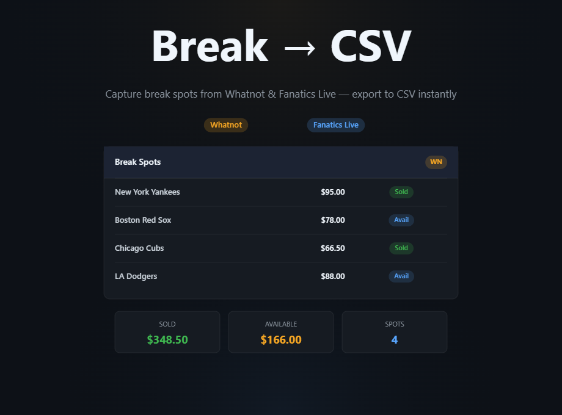

# Break → CSV (Whatnot + Fanatics Live)

A free Chrome extension to capture break spot data, tally the full break cost (sold + available), and export to CSV — no accounts, no servers, no data leaves your browser. Works on both **Whatnot** and **Fanatics Live**.

---

## Supported Platforms

| Platform | Break spots | Sold items tab | Discount / giveaway display |
|---|---|---|---|
| Whatnot | ✅ | ✅ | — |
| Fanatics Live | ✅ | — | ✅ |

---

## How to Use

### Whatnot

1. Open any Whatnot livestream with an active break
2. Click **"Buy Spots"** to open the break spot list
3. Slowly scroll through **all** spots — sold and available — so the extension can capture them
4. *(Optional)* Click the **Sold** tab on the stream and scroll through it to capture sold items separately
5. Click the extension icon in your toolbar to view and export

### Fanatics Live

1. Open any Fanatics Live stream with an active break
2. The extension captures break data automatically as the page loads — no special panel to open
3. Click the extension icon in your toolbar to view and export

---

## The Popup

Click the extension icon to open the popup. You'll see two sections:

**Breaks** — shows all captured break spots with:
- Platform badge (`WN` = Whatnot, `FL` = Fanatics Live)
- Spot name
- Price (with strikethrough original price when discounted; "FREE" for giveaway spots)
- Status (Sold / Available)
- Buyer username

**Sold Items** *(Whatnot only)* — shows individual sold items from the Sold tab with unit price, quantity, and buyer.

Each section has its own **Export** and **Clear** button. Exporting clears that section so you're ready for the next break.

---

## CSV Export

**↓ Export Breaks** includes:
- Break title, spot name, description
- Price, currency, status (Sold / Available), buyer username
- Summary totals (total sold, total available, grand total)

**↓ Export Sold** includes:
- Item title and description
- Unit price and total price, quantity, buyer username, transaction type
- Grand total

---

## Manual Install

1. **[Download the latest ZIP](https://github.com/ghostcrewcards/break-csv/releases/latest/download/break-csv-v1.2.0.zip)**
2. Unzip it anywhere on your computer
3. Open Chrome and go to `chrome://extensions`
4. Enable **Developer mode** (toggle in the top right)
5. Click **Load unpacked**
6. Select the unzipped folder
7. The extension icon will appear in your toolbar

---

## Privacy

- This extension only runs on `whatnot.com` and `fanatics.live`
- It reads GraphQL responses that your browser already receives when you browse those sites
- No data is sent anywhere — everything stays in your browser's local storage
- Exporting a CSV saves it directly to your computer

---

## FAQ

**The popup shows no data — what do I do?**
On Whatnot, make sure you've clicked "Buy Spots" to open the break panel and scrolled through the spots. On Fanatics Live, the data loads automatically when the break page loads. Try scrolling and waiting a few seconds, then click the extension icon again.

**I only see some of the spots.**
Scroll through the full list in the break panel (Whatnot) to load all spots. The extension captures data as it appears in the page.

**The sold items section is empty.**
The Sold Items section is Whatnot-only. Click the Sold tab on the Whatnot stream and scroll through it — that's what loads the data.

**Does it work for all break types?**
Yes — Random, Pick Your, and Standard breaks are all supported on Whatnot. All break types on Fanatics Live are supported.

**Will it work on recorded/past shows?**
No — it captures live GraphQL traffic, so it only works on active streams.

---

## Changelog

**v1.2.0**
- Added Fanatics Live support
- Platform badge (`WN` / `FL`) on every break spot row
- Discounted prices now show the original price as strikethrough
- Giveaway spots (100% off, $0) display "FREE"

**v1.0.0**
- Initial release (Whatnot only)

---

## Support

If you enjoy the extension or it saves you money on breaks, a coffee is always appreciated!

